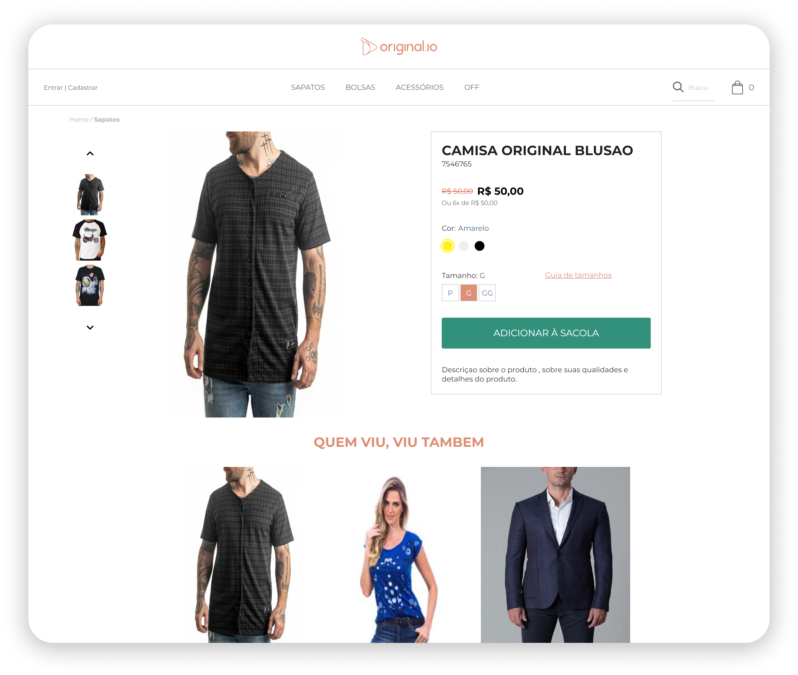
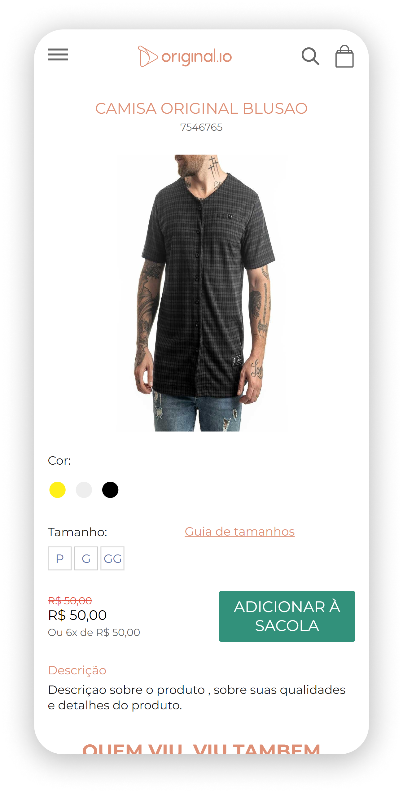

## Second challenge of the Tech Summer internship program.

In this challenge we had to create products pages using data from a JSON file.

The technologies used here:

[`React`](https://reactjs.org)

[`React Router`](https://reacttraining.com/react-router/web/guides/quick-start)

[`SASS`](https://sass-lang.com/)

[TypeScript](https://www.typescriptlang.org/)

[Json Server](https://www.npmjs.com/package/json-server)

### How to use the project:

    Clone this repository on your computer.
    Open the terminal and navigate to the project folder.
    Run the command: `npm server` to start the server.
    Run the command: `npm start` to start the application.
    Open the browser and navigate to: `http://localhost:3000/`

### Desktop:

### Mobile:

